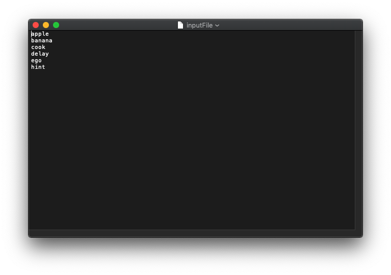
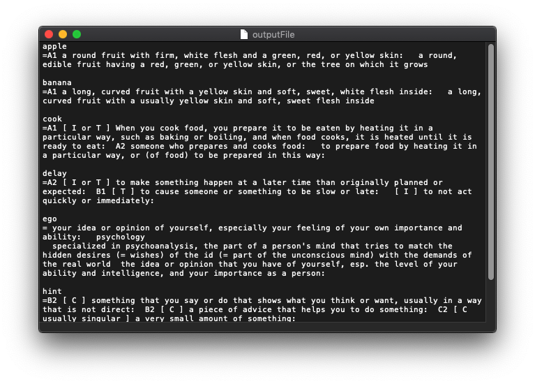

# Cambridge Dictionary E to E Scraper

> 2019.10.1.
>
> Jisung Jeong (Hanyang Univ.)
>
> python 3


## What is CDS

**CDS** is a file generator that find definitions of input word. (file form)

You can easily get the definitions you want to find. (English to English)


## How to use

1. make a file and write words per line.

   > input file
   > 

2. CLI

   ```
   python cds.py 'input file name' 'output file name' 'the number of definitions'
   ```

   > output file: 
   > 

